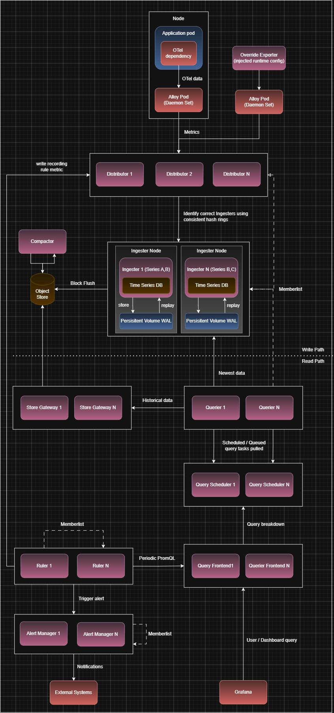

# Mimir

## Mimir Introduction

- Mimir ingests metrics from a Prometheus-compatible client like Grafana Alloy and stores them in a scalable manner to enable metrics querying
- At the simplest level, Alloy sends Mimir metrics and Mimir stores it in object storage like MinIO to query from later

## Classic Architecture

- The classic architecture splits Mimir into two paths:
  - `write path`: Application -> Alloy -> Distributor -> Ingester -> Object Storage
  - `read path`: Query Frontend -> Querier -> (Store Gateway -> Object Storage), Ingester
- The reason why Mimir is broken down into multiple components instead of a single service is because in an extremely large cluster, a single process cant handle everything
  - this is the issue with Prometheus
  - so it basically uses the same fundamental idea as microservices to achieve the functionality where each independent service can be scaled separately as required

### Write Path Components

#### Distributor

- The Distributor is the entry-point for metrics to Mimir
- This decides who should store this metric and forward the metric to the appropriate Ingester
- If there are multiple Ingesters, each handling a subset of the metrics, the Distributor maintains that internal mapping so that Alloy doesn't have to
- There can be multiple Distributors as well because it just acts as a router and can be scaled up
- The mapping of which metric to which Ingester is done using a hash ring maintained by `memberlist`
  - `memberlist` allows Mimir subcomponents to discover each other and exchange ring state
  - its a distributed system library where nodes gossip among each other to discover what nodes are currently existing and updates its internal ring state
  - this way, each instance of each subcomponent maintains its own internal cluster state which eventually converges into the actual cluster state
- Metrics belonging to a specific series are usually sent to the same Ingester
  - the series is hashed and the hash ring determines which Ingester to forward to
  - by default, it doesn't choose one Ingester but has a replication factor of 3, implying its forwarded to 3 Ingesters
  - each Ingester replica takes a set of series and that doesn't mean two replicas will handle the same set of series (one could handle AB, one could handle BC and another AC)
    - the ring actually stores multiple positions for each Ingester
    - when a metrics series is hashed, find as many distinct Ingesters as the replication factor starting from that position
    - the replication factor has nothing to do with how many positions each Ingester has on the ring
  - as long as there is a majority quorum (2), write is considered successful (in case an Ingester fails)

#### Ingester

- The Ingester is responsible for receiving and holding recently written time-series data before it is persisted into object storage
- Each ingester maintains a local time series DB (the same as Prometheus) containing the recent data that it is responsible for
- Once enough data is collected, it flushes the data to object storage as one block
- Each ingester also maintains a WAL on disk tied to a Persistent Volume so that if the Ingester goes down, when it comes back up, it can replay the WAL to rebuild the data
  - a `Persistent Volume` in Kubernetes is a dedicated storage resource that allows data to persist on a node across pod restarts
  - if the pod fails but the node remains, WAL can recover the data
  - when it cannot is why we have multiple replicas of Ingesters for each series
- Usually ingesters are scaled based on write volume but sometimes it may need to be scaled for read volume as well as newest data is queried directly from the Ingester

### Read Path Components

#### Query Frontend

- The user asks a query via Grafana
- The Query Frontend receives the query and can do the following things:
  - split large time-range queries into smaller pieces
  - forward the actual work plan to Query Scheduler
  - cache query results
- Scale this when there are a lot of queries to coordinate

#### Query Scheduler

- The Query Scheduler handles scheduling work for the Queriers after receiving queries from the Query Frontend so that the work is evenly queued and distributed
- If one giant query exists, it is usually split by the Query Frontend and then the parts scheduled alongside other concurrent queries instead of it hogging all the queriers
- The scheduled work is maintained in memory and in case of failures:
  - if a Query Scheduler dies, the Query Frontend can retry the query as it still hasn't received the results
  - if a Querier dies after pulling some work from the Query Scheduler, the Query Scheduler detects that connection to the Querier is lost and notifies the Query Frontend to retry
- This is scaled when there are a lot of queries to coordinate

#### Querier

- The Querier is responsible for fetching the actual data after pulling an available work item from the Query Scheduler over a persistent gRPC connection
- Multiple queriers can be involved for a single query
- Queriers fetch newest data from the Ingesters and older data from Store Gateway
  - it uses the same hash ring to figure out which metric exists in which Ingester
- Scale this when there is a lot of query compute required
  - specifically useful when there are more queries for long time ranges which can then be split and distributed across more queriers

#### Store Gateway

- The Queriers shouldn't have to independently figure out which block in object store is the relevant data in
- The Store Gateway answers this question and fetches the relevant data from the object store for the Querier
- The Store Gateway maintains internal indexes to optimize fetching blocks from the object store
- Scale this when there are more historical queries

### Background Components

#### Compactor

- Over time, Mimir can accumulate a very large number of blocks
- The Compactor consolidates multiple blocks into a single larger block that is more efficient to query and store
- The Compactor also removes data that is older than the retention period

#### Ruler

- The Ruler periodically evaluates metrics using PromQL rules which can be of two types:
  - Recording rules: Calculate a metric and store it back to Mimir
  - Alerting rules: Evaluate an alert condition and trigger an alert to Alert Manager
- The rules are evaluated using PromQL and the Ruler actually forwards the PromQL to the Query Front-end
- The evaluated metric for a recording rule is written back to Mimir by forwarding it to the Distributor
- Rulers also participate in a consistent hash ring so that a distinct group of rules is assigned to a specific Ruler instance
  - memberlist helps in detecting when a Ruler is down and the rule group ownership is reassigned
- Scale this when there are a lot of rules to evaluate

#### Alert Manager

- AlertManager handles what happens when there is an alert triggered by the Ruler such as:
  - grouping related alerts so as to not get overwhelmed by number of alerts
  - deduplicating the same alert received from multiple Ruler instances
  - routing alert to different receivers like Email/Slack/PagerDuty
  - silencing alerts which are decided to be unimportant for the time being
  - inhibition of alerts based on presence of another alert
- Alert manager replicas have to share state about what alerts currently exist so that alerts are not managed in silos
  - they maintain local state and also use memberlist to gossip about their local state to synchronize
- Scale this when there a lot of alerts being triggered from the ruler or there are a lot of notifications to trigger

#### Overrides Exporter

- This is a fairly specific and optional component
- Mimir has limits for each tenant which are parts of Mimir's runtime configuration, but these are internal details and not exposed as metrics
  - a tenant can be thought of a logically independent entity that Mimir is ingesting metrics for (like a team among other teams sharing the same Mimir ingrastructure)
  - Mimir allows specifying tenant-specific limits so that one tenant cannot hog all available resources -> these are called tenant overrides
  - Mimir can override things such as:
    - ingestion limits
    - series limits
    - query limits
    - ruler limits
    - query parallelism
    - retention limits
- The Overrides Exporter exports these tenant overrides and makes them available as metrics queryable in Grafana
  - Alloy actually scrapes the exporter like it does for applications and writes the data into Mimir using its write path components
  - The Exporter doesn't directly talk to Mimir components and just reads the Mimir runtime configuration file and lets Alloy scrape that data using its `/metrics` endpoint
- Usually a single replica of the Overrides exporter is recommended per Mimir deployment as the runtime configuation is common

Continue from https://chatgpt.com/c/6aa5d91f-8220-83e8-8793-5031a4af773c

### Install Mimir in Classic Architecture

- We will begin by inistalling Mimir in classic architecture:
  - we can see what all sub-components this will install by running `helm template mimir grafana/mimir-distributed -f mimir/mimir-classic-values.yaml -n observability > mimir/mimir-rendered.yaml`
- Run `helm install mimir -f mimir/mimir-classic-values.yaml grafana/mimir-distributed -n observability` to install Mimir in distributed mode in the `observability` namespace

---

## Ingest Storage Architecture [TODO]
