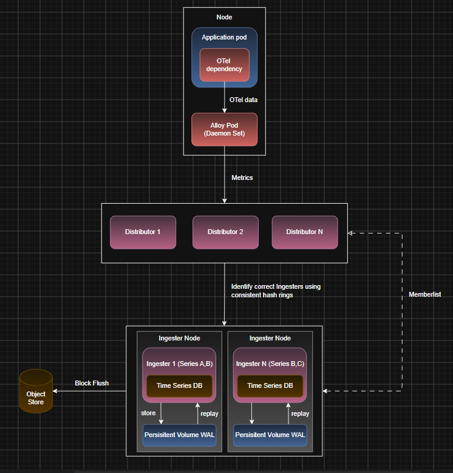

# Mimir

## Mimir Introduction

- Mimir ingests metrics from a Prometheus-compatible client like Grafana Alloy and stores them in a scalable manner to enable metrics querying
- At the simplest level, Alloy sends Mimir metrics and Mimir stores it in object storage like MinIO to query from later

## Classic Architecture

- The classic architecture splits Mimir into two paths:
  - `write path`: Application -> Alloy -> Distributor -> Ingester -> Object Storage
  - `read path`: Query Frontend -> Querier -> Store Gateway -> Object Storage
- The reason why Mimir is broken down into multiple components instead of a single service is because in an extremely large cluster, a single process cant handle everything
  - this is the issue with Prometheus
  - so it basically uses the same fundamental idea as microservices to achieve the functionality where each independent service can be scaled separately as required

### Write Path

#### Distributor

- The Distributor is the entry-point for metrics to Mimir
- This decides who should store this metric and forward the metric to the appropriate Ingester
- If there are multiple Ingesters, each handling a subset of the metrics, the Distributor maintains that internal mapping so that Alloy doesn't have to
- There can be multiple Distributors as well because it just acts as a router and can be scaled up
- The mapping of which metric to which Ingester is done using a hash ring maintained by `memberlist`
  - `memberlist` allows Mimir subcomponents to discover each other and exchange ring state
  - its a distributed system library where nodes gossip among each other to discover what nodes are currently existing and updates its internal ring state
  - this way, each instance of each subcomponent maintains its own internal cluster state which eventually converges into the actual cluster state
- Metrics belonging to a specific series are usually sent to the same Ingester
  - the series is hashed and the hash ring determines which Ingester to forward to
  - by default, it doesn't choose one Ingester but has a replication factor of 3, implying its forwarded to 3 Ingesters
  - each Ingester replica takes a set of series and that doesn't mean two replicas will handle the same set of series (one could handle AB, one could handle BC and another AC)
    - the ring actually stores multiple positions for each Ingester
    - when a metrics series is hashed, find as many distinct Ingesters as the replication factor starting from that position
    - the replication factor has nothing to do with how many positions each Ingester has on the ring
  - as long as there is a majority quorum (2), write is considered successful (in case an Ingester fails)

#### Ingester

- The Ingester is responsible for receiving and holding recently written time-series data before it is persisted into object storage
- Each ingester maintains a local time series DB containing the recent data that it is responsible for
- Once enough data is collected, it flushes the data to object storage as one block
- Each ingester also maintains a WAL on disk tied to a Persistent Volume so that if the Ingester goes down, when it comes back up, it can replay the WAL to rebuild the data
  - a `Persistent Volume` in Kubernetes is a dedicated storage resource that allows data to persist on a node across pod restarts
  - if the pod fails but the node remains, WAL can recover the data
  - when it cannot is why we have multiple replicas of Ingesters for each series

### Read Path

#### Query Front-end

Continue from https://chatgpt.com/c/6aa5d91f-8220-83e8-8793-5031a4af773c

---

## Install Mimir

- We will begin by inistalling Mimir in classic architecture:
  - we can see what all sub-components this will install by running `helm template mimir grafana/mimir-distributed -f mimir/mimir-classic-values.yaml -n observability > mimir/mimir-rendered.yaml`
- Run `helm install mimir -f mimir/mimir-classic-values.yaml grafana/mimir-distributed -n observability` to install Mimir in distributed mode in the `observability` namespace
