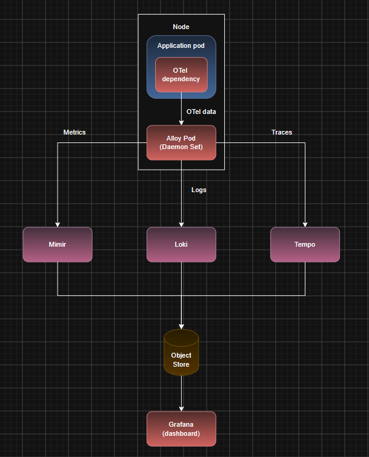

# Kubernetes Observability Stack

## LGTM Component Stack

Our Kubernetes Observability Stack will consist of the following:

### Grafana (Visualization and Alerting)

- Its the interface to the entire stack and doesn't store any data itself
- it has dashboards which visualizes system using graphs and charts
- Allows to click on a spike on a graph and instantly see the matching logs and trace the error path
- Evaluates data from all sources and can send alerts

### Loki (Log Aggregation)

- Storage and query engine for logs
- Instead of indexing full text, it only indexes labels, which makes storage cheaper
- Uses a query language to filter, search through log lines

### Tempo (Distributed Tracing)

- Handles high-scale distbuted tracing
- Traces a request as it travels across multiple services and system components
- Helps in root cause analysis

### Mimir (Metrics Engine)

- Prometheus is a single-server, pull-based monitoring tool that stores data on disk with short retention
- Mimir acts as long-term storage and query engine for metrics like CPU/memory/throughput etc
- Both speak the same query language to query metrics
- Use only Prometheus if a single Prometheus server is able to continue collecting metrics across the cluster without crashing
- If it starts crashing, we use Mimir which horizontally scales Prometheus functionality

### OpenTelemetry (Data Collector)

- OTel acts as a single dependency that can collects logs, metrics and traces from an app and forward them to a separately deployed entity called Collector
- Then the Collector routes the logs to Loki, metrics to Prometheus or Mimir, tracing data to Tempo
- Collectors can be OTel Collector or Grafana Alloy
- Grafana Alloy is an advanced distbution of OTel Collector that allows more features than OTel Collector

---

## Installing LGTM components

- `kubectl create ns observability` to create a new namespace to deploy the LGTM stack components (start from `helm-deployments/observability`)
- To add the charts, lets add their corresponding repositories first:
  - `helm repo add grafana https://grafana.github.io/helm-charts` has Mimir and Alloy
  - `helm repo add grafana-community https://grafana-community.github.io/helm-charts` has Loki, Tempo and Grafana
  - `helm repo update` to sync the latest version to local
- Now continue from `mimir.md` for Mimir installation
